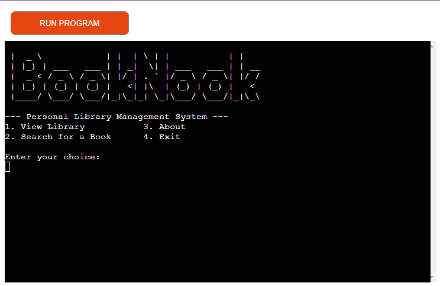
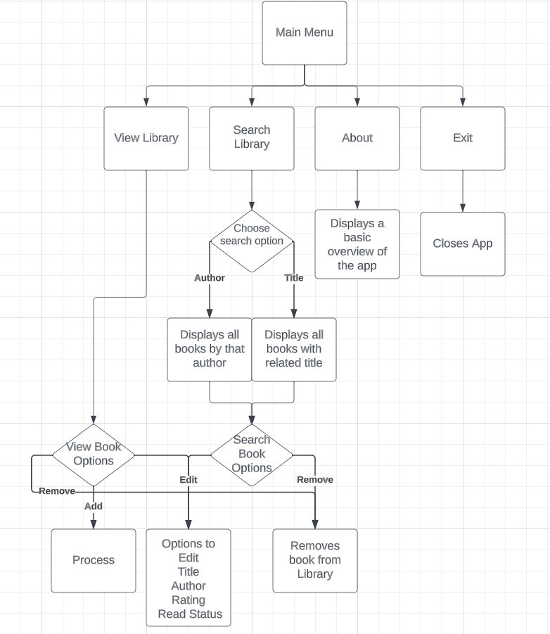
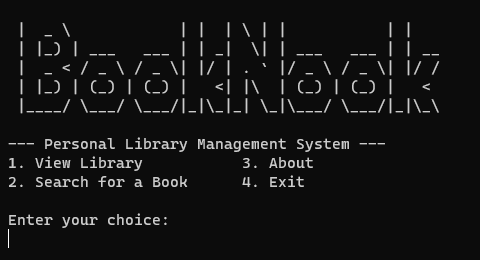
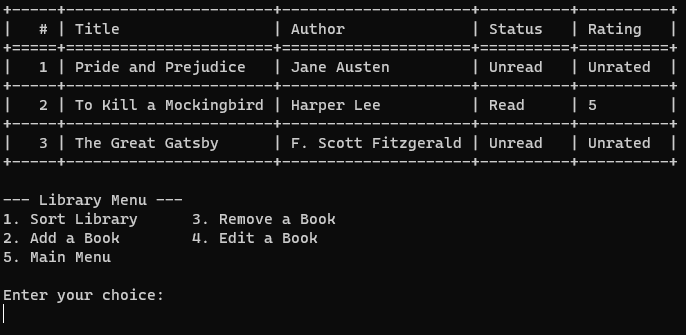
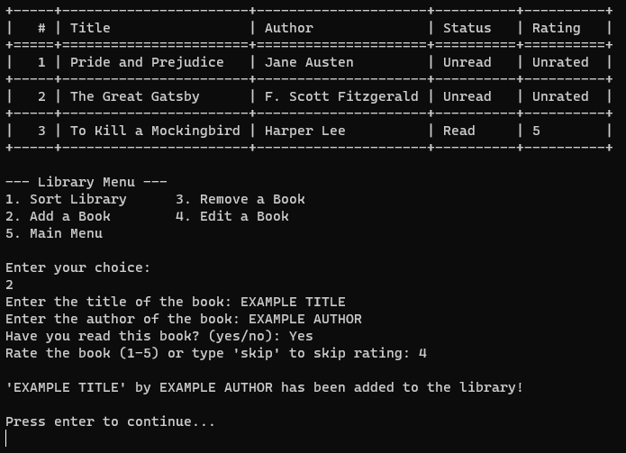
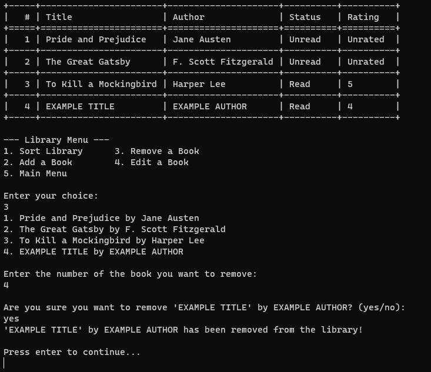
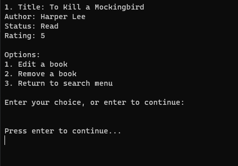
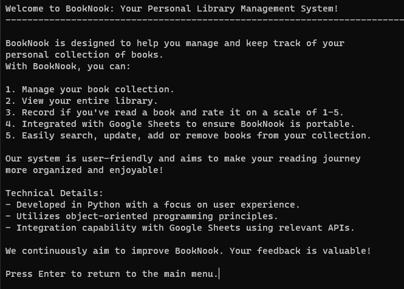

# BookNook Library Management System
BookNook is a Python-based library management system that allows users to manage their personal collection of books.
It integrates with Google Sheets to provide a portable solution for tracking books.

BookNook is deployed on Heroku [BookNook](https://booknook-afb7e122162f.herokuapp.com/).

## Contents

- [Purpose](#purpose)
- [user experience](#user-experience)
    * [User Stories](#user-stories)
    * [Design](#design)
    * [Flowchart](#flowchart)
- [Features](#features)
    * [Existing Features](#existing-features)
        * [Main Menu](#main-menu)
            * [View Library](#view-library)
                * [Sort Library](#sort-library)
                    * [Sort by Title](#sort-by-title)
                    * [Sort by Author](#sort-by-author)
                    * [Sort by read status](#sort-by-read-status)
                    * [Sort by rating](#sort-by-rating)
                * [Add Book](#add-book)
                * [Remove Book](#remove-book)
                * [Edit Book](#edit-book)
            * [Search for a Book](#search-for-a-book)
                * [Search by Title](#search-by-title)
                * [Search by Author](#search-by-author)
            * [About](#about)
            * [Exit](#exit)
    * [Features Left to Implement](#features-left-to-implement)
- [Technologies Used](#technologies-used)
    * [Languages](#languages)
    * [Libraries](#libraries)
    * [Tools](#tools)
- [Testing](#testing)
    * [Manual Testing](#manual-testing)
        * [Test 1: Main Menu](#test-1-main-menu)
        * [Test 2: View Library](#test-2-view-library)
        * [Test 3: Sort Library](#test-3-sort-library)
        * [Test 4: Add Book](#test-4-add-book)
        * [Test 5: Remove Book](#test-5-remove-book)
        * [Test 6: Edit Book](#test-6-edit-book)
        * [Test 7: Search for a Book](#test-7-search-for-a-book)
        * [Test 8: About](#test-8-about)
        * [Test 9: Exit](#test-9-exit)
    * [Bugs](#bugs)

- [Deployment](#deployment)

- [Credits](#credits)
    * [Content](#content)

## Purpose
The purpose of this project is to create a library management system that allows users to manage their personal collection of books. It integrates with Google Sheets to provide a portable solution for tracking books. The user can add, edit, remove, and search for books in their library. The user can also sort their library by title, author, read status, and rating.

This program is developed to demonstrate competency in python programming and is purely for educational purposes.

## User Experience

### User Stories
This program is designed to be used by a user who wants to manage their personal collection of books. The user can add, edit, remove, and search for books in their library. The user can also sort their library by title, author, read status, and rating.

As a user, I want to be able to:
- View all the books in my library
- Add a book to my library
- Edit a book in my library
- Remove a book from my library
- Search for a book in my library
- Sort my library

### Design
The program is designed to be simple and intuitive to use. The user is presented with a main menu that allows them to navigate to the different features of the program. The user can navigate the menu by entering in the corresponding number for the menu item they want to select. The user can also exit the program by entering in the corresponding number for the exit menu item.

### Flowchart
During the planning phase of this project, a flowchart was created to help visualize the program's logic. The flowchart can be found below.

The flowchart was created using [lucidchart](https://www.lucidchart.com/) and was used as a guide to help develop the program.

## Features

### Existing Features
#### Main Menu
The main menu is the first screen the user sees when they run the program. It allows the user to navigate to the different features of the program.
View Library, Search for a Book, About, and Exit.

#### View Library
The view library feature allows the user to view all the books in their library. The user can also sort their library , add a book, remove a book, and edit a book.

All the books in the library are displayed in a table format. The table contains the following columns: index, title, author, read status, and rating.

The information is retrieved from a Google Sheet this is also where all the changes are saved.

- #### Sort Library
    The sort library feature allows the user to sort their library by title, author, read status, and rating.

    - ##### Sort by Title
        The sort by title feature allows the user to sort their library by title 

    - ###### Sort by Author
        The sort by author feature allows the user to sort their library by author

    - ###### Sort by read status
        The sort by read status feature allows the user to sort their library by read status

    - ###### Sort by rating
        The sort by rating feature allows the user to sort their library by rating

- #### Add Book
    The add book feature allows the user to add a book to their library. The user is prompted to enter in the title, author, if they have read the book, and their rating of the book.

    Adding the book to the library also adds the book to the Google Sheet. 

    

- #### Remove Book
    The remove book feature allows the user to remove a book from their library. The user is prompted to enter in the index number of the book they want to remove.
    The user is then prompted to confirm if they want to remove the book.

    Removing the book from the library also removes the book from the Google Sheet.

    

- #### Edit Book
    The edit book feature allows the user to edit a book in their library. The user is prompted to enter in the index number of the book they want to edit.
    The user is then prompted to enter in the new title, author, if they have read the book, and their rating of the book.
    They also have the option to press enter to keep the original value.
    They are then prompted to confirm if they want to edit the book.

    All edits are saved to the Google Sheet.

    

#### Search for a Book
The search for a book feature allows the user to search for a book in their library. The user can search by title or author.

The search feature allows for partial matches. For example, if the user searches for "Har", the author the program will return all books that contain "Har" as the author eg. Harry, Harvey.

The user is then given the option to edit or remove the book or return to the main menu.

- #### Search by Title
    The search by title feature allows the user to search for a book by title.

- #### Search by Author
    The search by author feature allows the user to search for a book by author.

#### About
The about feature displays information about the program.

#### Exit
The exit feature allows the user to exit the program.

### Features Left to Implement
- Add a feature to allow the user to export their library to a csv file.
- Add a feature to allow the user to import their library from a csv file.
- Add a page feature to allow the user to view their library in pages.

## Technologies Used

### Languages
- [Python](https://www.python.org/)
    - The project uses **Python** to create the program.

### Libraries
- [gspread](https://docs.gspread.org/en/latest/)
    - The project uses **gspread** to interact with Google Sheets.
- [oauth2client](https://oauth2client.readthedocs.io/en/latest/)
    - The project uses **oauth2client** to authenticate with Google Sheets.
- [Tabulate](https://pypi.org/project/tabulate/)
    - The project uses **tabulate** to display the library in a table format.
- [os](https://docs.python.org/3/library/os.html)
    - The project uses **os** to interact with the operating system.

### Tools
- [Google Sheets](https://www.google.com/sheets/about/)
    - The project uses **Google Sheets** to store the library data.
- [Lucidchart](https://www.lucidchart.com/)
    - The project uses **Lucidchart** to create the flowchart.
- [Github](https://github.com)
    - The project uses **Github** to store the project's code.
- [Heroku](https://www.heroku.com/)
    - The project uses **Heroku** to host the project.
- [Git](https://git-scm.com/)
    - The project uses **Git** for version control.
- [Visual Studio Code](https://code.visualstudio.com/)
    - The project uses **Visual Studio Code** as the IDE.

## Testing
### Linter Testing
The program was tested using [CI Python Linter](https://pep8ci.herokuapp.com/). 

The program passed with errors in the Ascii art used for the Title.
This is due to using \ which creates invalid escape sequence errors.

The other error comes from line 517 
            print(
                f"Rating: "
                # Unable to shorten below line to less than 80 characters
                # due to f-string formatting
517             f"{rating if rating.isdigit() and 1 <= int(rating) <= 5 else 'Unchanged'}"
            )
I was unable to shorten the line below 80 characters due to f-string formatting.

### Manual Testing
#### Test 1: Main Menu
1. Run the program.
2. The main menu is displayed.
3. Press 1 to view the library.
4. The library is displayed.
5. Press 2 to search for a book.
6. The search for a book menu is displayed.
7. Restart the program.
8. The main menu is displayed.
9. Press 3 to view the about page.
10. The about page is displayed.
11. Press enter.
12. The main menu is displayed.
13. Press 4 to exit the program.
14. The program exits.

#### Test 2: Main Menu Error Handling
1. Run the program.
2. The main menu is displayed.
3. Press 5.
4. User gets Invalid choice. Please try again.
5. Press enter to try again.
6. Press 0.
7. User gets Invalid choice. Please try again.
8. Press enter to try again.
9. Press a.
10. User gets Invalid choice. Please try again.
11. Press enter to try again.
12. Press 1 to view the library.
13. The library is displayed.

#### Test 3: View Library - Sort Library
1. Run the program.
2. The main menu is displayed.
3. Press 1 to view the library.
4. The library is displayed.
5. Press 1 to sort the library
6. Press 1 to sort by title.
7. The library is sorted by title.
8. Press 1 to sort the library.
9. Press 2 to sort by author.
10. The library is sorted by author.
11. Press 1 to sort the library.
12. Press 3 to sort by read status.
13. The library is sorted by read status.
14. Press 1 to sort the library.
15. Press 4 to sort by rating.
16. The library is sorted by rating.

#### Test 4: View Library - Sort Library Error Handling
1. Run the program.
2. The main menu is displayed.
3. Press 1 to view the library.
4. The library is displayed.
5. Press 1 to sort the library.
6. Press 5.
7. User gets Invalid choice. Please enter a number from the options and try again.
8. Press 0.
9. User gets Invalid choice. Please enter a number from the options and try again.
10. Press a.
11. User gets Invalid choice. Please enter a number from the options and try again.
12. Press 1 to sort by title.
13. The library is sorted by title.

#### Test 5: View Library - Add Book
1. Run the program.
2. The main menu is displayed.
3. Press 1 to view the library.
4. The library is displayed.
5. Press 2 to add a book.
6. The user is prompted to enter in the title of the book.
7. Enter in the title of the book.
8. The user is prompted to enter in the author of the book.
9. Enter in the author of the book.
10. The user is prompted to enter in if they have read the book.
11. Enter in if they have read the book.
12. The user is prompted to enter in their rating of the book.
13. Enter in their rating of the book.
14. The book is added to the library.
15. The book is added to the Google Sheet.

#### Test 5: View Library - Add Book Error Handling
1. Run the program.
2. The main menu is displayed.
3. Press 1 to view the library.
4. The library is displayed.
5. Press 2 to add a book.
6. The user is prompted to enter in the title of the book.
7. Press enter.
8. User gets The title cannot be blank. Please enter a title and is prompted to enter in the title of the book.
9. Enter in the title of the book.
10. The user is prompted to enter in the author of the book.
11. Press enter.
12. User gets The author cannot be blank. Please enter an author and is prompted to enter in the author of the book.
13. Enter in the author of the book.
14. The user is prompted Have you read this book? (yes/no):
15. Press enter.
16. User gets Invalid response. Please enter 'yes' or 'no'. and is prompted to enter in if they have read the book.
17. Enter in yes they have read the book.
18. The user is prompted to enter in their rating of the book.
19. Press enter.
20. User gets Invalid rating. Please choose between 1-5 or type 'skip'. and is prompted to enter in their rating of the book.
21. Enter in their rating of the book.
22. The book is added to the library.
23. The book is added to the Google Sheet.

#### Test 6: View Library - Remove Book
1. Run the program.
2. The main menu is displayed.
3. Press 1 to view the library.
4. The library is displayed.
5. Press 3 to remove a book.
6. The user is prompted to enter in the index number of the book they want to remove.
7. Enter in the index number of the book they want to remove.
8. The user is prompted to confirm if they want to remove the book.
9. Enter in yes.
10. The book is removed from the library.
11. The book is removed from the Google Sheet.

#### Test 6: View Library - Remove Book Error Handling
1. Run the program.
2. The main menu is displayed.
3. Press 1 to view the library.
4. The library is displayed.
5. Press 3 to remove a book.
6. The user is prompted to enter in the index number of the book they want to remove.
7. Press enter.
8. User gets Please enter a valid number. Enter the number of the book you want to remove:
9. Enter in the index number of the book they want to remove.
10. The user is prompted to confirm if they want to remove the book.
11. Press enter.
12. User gets Please respond with 'yes' or 'no'.
13. Enter in yes.
14. The book is removed from the library.
15. The book is removed from the Google Sheet.

#### Test 7: View Library - Edit Book
1. Run the program.
2. The main menu is displayed.
3. Press 1 to view the library.
4. The library is displayed.
5. Press 4 to edit a book.
6. The user is prompted to enter in the index number of the book they want to edit.
7. Enter in the index number of the book they want to edit.
8. The user is prompted to enter in the new title of the book.
9. Enter in the new title of the book.
10. The user is prompted to enter in the new author of the book.
11. Enter in the new author of the book.
12. The user is prompted to enter in if they have read the book.
13. Enter in if they have read the book.
14. The user is prompted to enter in their new rating of the book.
15. Enter in their new rating of the book.
16. The user is prompted to confirm if they want to edit the book.
17. Enter in yes.
18. The book is edited in the library.
19. The book is edited in the Google Sheet.

#### Test 7: View Library - Edit Book Error Handling
1. Run the program.
2. The main menu is displayed.
3. Press 1 to view the library.
4. The library is displayed.
5. Press 4 to edit a book.
6. The user is prompted to enter in the index number of the book they want to edit.
7. Press enter.
8. User gets Invalid input! The book number cannot be blank. Please enter a number.
9. Enter in the index number of the book they want to edit.
10. The user is prompted with Current title is 'BOOK TITLE'. Enter new title or press Enter to keep it:
11. Press enter.
12. The user is prompted with Current author is 'BOOK AUTHOR'. Enter new author or press Enter to keep it:
13. Press enter.
14. The user is prompted with Is the book read? (current: Read). Enter 'yes' or 'no':
15. Press enter.
16. The user is prompted with Current rating is 'BOOK RATING'. Enter new rating or press Enter to keep it:
17. Press enter.
18. The user is prompted Are these changes correct? press Enter to discard changes (yes/no): 
19. Press enter.
20. User gets Invalid response. Please enter 'yes' or 'no'.
21. The user is prompted Are these changes correct? press Enter to discard changes (yes/no):
22. Enter in yes.
23. The book is edited in the library.
24. The book is edited in the Google Sheet.

#### Test 8: Search for a Book - Search by Title
1. Run the program.
2. The main menu is displayed.
3. Press 2 to search for a book.
4. The search for a book menu is displayed.
5. Press 1 to search by title.
6. The user is prompted to enter in the title of the book they want to search for.
7. Enter in the title of the book they want to search for.
8. The book is displayed.
9. The user is prompted to edit or remove the book or return to the main menu.
10. Press 1 to edit the book.
11. The user is prompted to enter in the new title of the book.
12. Enter in the new title of the book.
13. The user is prompted to enter in the new author of the book.
14. Enter in the new author of the book.
15. The user is prompted to enter in if they have read the book.
16. Enter in if they have read the book.
17. The user is prompted to enter in their new rating of the book.
18. Enter in their new rating of the book.
19. The user is prompted to confirm if they want to edit the book.
20. Enter in yes.
21. The book is edited in the library.
22. The book is edited in the Google Sheet.
23. The user is prompted to edit or remove the book or return to the main menu.
24. Press 2 to remove the book.
25. The user is prompted to confirm if they want to remove the book.
26. Enter in yes.
27. The book is removed from the library.
28. The book is removed from the Google Sheet.
29. The user is prompted to edit or remove the book or return to the main menu.
30. Press 3 to return to the main menu.
31. The main menu is displayed.

#### Test 8: Search for a Book - Search by Title Error Handling
1. Run the program.
2. The main menu is displayed.
3. Press 2 to search for a book.
4. The search for a book menu is displayed.
5. Press 1 to search by title.
6. The user is prompted to enter in the title of the book they want to search for.
7. Press enter.
8. Entire library is displayed.
9. The user is prompted to edit or remove the book or return to the main menu.
10. Edit and Remove functions the same as the Edit Book and Remove Book features.

#### Test 9: Search for a Book - Search by Author
1. Run the program.
2. The main menu is displayed.
3. Press 2 to search for a book.
4. The search for a book menu is displayed.
5. Press 2 to search by author.
6. The user is prompted to enter in the author of the book they want to search for.
7. Enter in the author of the book they want to search for.
8. The book is displayed.
9. The user is prompted to edit or remove the book or return to the main menu.
10. Edit and Remove functions the same as the Edit Book and Remove Book features.

#### Test 9: Search for a Book - Search by Author Error Handling
1. Run the program.
2. The main menu is displayed.
3. Press 2 to search for a book.
4. The search for a book menu is displayed.
5. Press 2 to search by author.
6. The user is prompted to enter in the author of the book they want to search for.
7. Press enter.
8. Entire library is displayed.
9. The user is prompted to edit or remove the book or return to the main menu.
10. Edit and Remove functions the same as the Edit Book and Remove Book features.

#### Test 10: About
1. Run the program.
2. The main menu is displayed.
3. Press 3 to view the about page.
4. The about page is displayed.
5. Press enter.
6. The main menu is displayed.

#### Test 11: Exit
1. Run the program.
2. The main menu is displayed.
3. Press 4 to exit the program.
4. The program exits.

### Bugs

## Deployment
### Heroku
This project is deployed on [Heroku](https://www.heroku.com/).

To deploy this project on Heroku, follow these steps:

1.  Log in to Heroku or create an account if necessary.
2.  Click on the button labeled "New" from the dashboard in the top right corner and select the "Create new app" option in the drop-down menu.
3. Enter a unique name for the application and select the region you are in.
        For this project, the unique name is "booknook" and the region selected is Europe.
4. Click on "create app".
5. Navigate to the settings tab and locate the "Config Vars" section and click "Reveal config vars".
6. Add a config var 
    * In the "KEY" field:
        *  enter "CREDS" in capital letters.
    * In the "VALUE" field:
        * copy and paste the contents of your creds.json file and click "Add".
7. Add another config var.
    * In the "KEY" field:
        * enter PORT in all capital letters.
    * In the "VALUE" field:
        * enter 8000 and click "Add".
8. Scroll to the "Buildpacks" section and click "Add buildpack".
9. Select Python and save changes.
10. Add another buildpack and select Nodejs then save changes again.
11. Ensure that the python buildpack is above the Nodejs buildpack.
12. Navigate to the "Deploy" section by clicking the "Deploy" tab in the top navbar.
13. Select "GitHub" as the deployment method and click "Connect to GitHub".
14. Search for the GitHub repository name in the search bar.
15. Click on "connect" to link the repository to Heroku.
16. Scroll down and click on "Deploy Branch".
17. Once the app is deployed, Heroku will notify you and provide a button to view the app.

### Forking The Repository

This can be done to create a copy of the repository. The copy can be viewed and edited without affecting the original repository.

To fork the repository through GitHub, take the following steps:
1. In the "Booknook" repository, click on the "fork" tab in the top right corner.
2. Click on "create fork" to fork the repository.

### Cloning The Repository

To clone the repository through GitHub:

1. In the repository, select the "code" tab located just above the list of files and next to the gitpod button.
2. Ensure HTTPS is selected in the dropdown menu.
3. Copy the URL under HTTPS.
4. Open Git Bash in your IDE of choice.
5. Change the current working directory to the location where you want the cloned directory to be created.
6. Type "git clone" and paste the URL that was copied from the repository.
7. Press the "enter" key to create the clone.

### APIs 
In order for the app to function properly, APIs need to be set up and connected. In particular, the following APIs were used for this project:

* Google Drive API.
   * This helps with getting credentials to access the files within google drive.
* Google Sheets API.
   * This is the API for the google sheets where the data is stored for the program.

I followed the steps in a video from the [Code Institute](https://codeinstitute.net/global/) Love Sandwiches project on how to set up and connect APIs. The link to this video is [here](https://www.youtube.com/watch?v=WTll5p4N7hE).

## Credits

### Content
- The code for the main menu was adapted from the [Code Institute](https://codeinstitute.net/global/) Love Sandwiches project.
- The code for the search function was helped by [ChatGPT](https://chat.openai.com/) as finding a clear solution was difficult. 
- The content in the spread sheet was generated using [Random Book Generator](https://www.randomlists.com/random-books)

