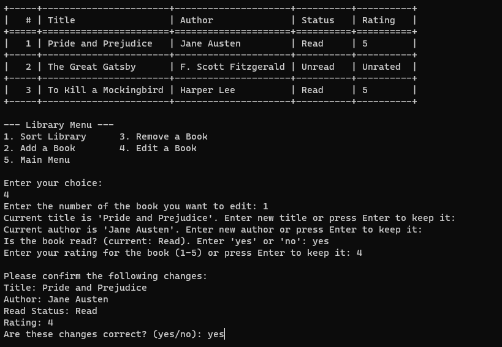
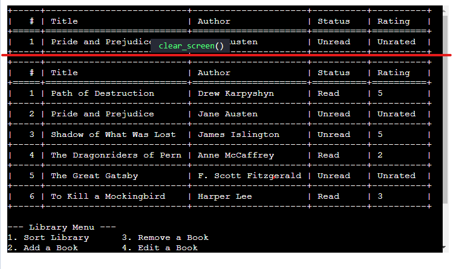

# BookNook Library Management System
BookNook is a Python-based library management system that allows users to manage their personal collection of books.
It integrates with Google Sheets to provide a portable solution for tracking books.


BookNook is deployed on Heroku [BookNook](https://booknook-afb7e122162f.herokuapp.com/).

## Contents

- [Purpose](#purpose)
- [user experience](#user-experience)
    * [User Stories](#user-stories)
    * [Design](#design)
    * [Flowchart](#flowchart)
- [Features](#features)
    * [Existing Features](#existing-features)
        * [Main Menu](#main-menu)
            * [View Library](#view-library)
                * [Sort Library](#sort-library)
                    * [Sort by Title](#sort-by-title)
                    * [Sort by Author](#sort-by-author)
                    * [Sort by read status](#sort-by-read-status)
                    * [Sort by rating](#sort-by-rating)
                * [Add Book](#add-book)
                * [Remove Book](#remove-book)
                * [Edit Book](#edit-book)
            * [Search for a Book](#search-for-a-book)
                * [Search by Title](#search-by-title)
                * [Search by Author](#search-by-author)
            * [About](#about)
            * [Exit](#exit)
    * [Features Left to Implement](#features-left-to-implement)
- [Technologies Used](#technologies-used)
    * [Languages](#languages)
    * [Libraries](#libraries)
    * [Tools](#tools)
- [Testing](#testing)
    * [Manual Testing](#manual-testing)
        * [Test 1: Main Menu](#test-1-main-menu)
        * [Test 2: View Library](#test-2-view-library)
        * [Test 3: Sort Library](#test-3-sort-library)
        * [Test 4: Add Book](#test-4-add-book)
        * [Test 5: Remove Book](#test-5-remove-book)
        * [Test 6: Edit Book](#test-6-edit-book)
        * [Test 7: Search for a Book](#test-7-search-for-a-book)
        * [Test 8: About](#test-8-about)
        * [Test 9: Exit](#test-9-exit)
    * [Bugs](#bugs)

- [Deployment](#deployment)

- [Credits](#credits)
    * [Content](#content)

## Purpose
The purpose of this project is to create a library management system that allows users to manage their personal collection of books. It integrates with Google Sheets to provide a portable solution for tracking books. The user can add, edit, remove, and search for books in their library. The user can also sort their library by title, author, read status, and rating.

This program is developed to demonstrate competency in python programming and is purely for educational purposes.

## User Experience

### User Stories
This program is designed to be used by a user who wants to manage their personal collection of books. The user can add, edit, remove, and search for books in their library. The user can also sort their library by title, author, read status, and rating.

As a user, I want to be able to:
- View all the books in my library
- Add a book to my library
- Edit a book in my library
- Remove a book from my library
- Search for a book in my library
- Sort my library

### Design
The program is designed to be simple and intuitive to use. The user is presented with a main menu that allows them to navigate to the different features of the program. The user can navigate the menu by entering in the corresponding number for the menu item they want to select. The user can also exit the program by entering in the corresponding number for the exit menu item.

### Flowchart
During the planning phase of this project, a flowchart was created to help visualize the program's logic. The flowchart can be found below.

The flowchart was created using [lucidchart](https://www.lucidchart.com/) and was used as a guide to help develop the program.


## Features

### Existing Features
#### Main Menu
The main menu is the first screen the user sees when they run the program. It allows the user to navigate to the different features of the program.
View Library, Search for a Book, About, and Exit.


#### View Library
The view library feature allows the user to view all the books in their library. The user can also sort their library , add a book, remove a book, and edit a book.

All the books in the library are displayed in a table format. The table contains the following columns: index, title, author, read status, and rating.

The information is retrieved from a Google Sheet this is also where all the changes are saved.


- #### Sort Library
    The sort library feature allows the user to sort their library by title, author, read status, and rating.

    - ##### Sort by Title
        The sort by title feature allows the user to sort their library by title 

    - ###### Sort by Author
        The sort by author feature allows the user to sort their library by author

    - ###### Sort by read status
        The sort by read status feature allows the user to sort their library by read status

    - ###### Sort by rating
        The sort by rating feature allows the user to sort their library by rating

- #### Add Book
    The add book feature allows the user to add a book to their library. The user is prompted to enter in the title, author, if they have read the book, and their rating of the book.

    Adding the book to the library also adds the book to the Google Sheet. 

    

- #### Remove Book
    The remove book feature allows the user to remove a book from their library. The user is prompted to enter in the index number of the book they want to remove.
    The user is then prompted to confirm if they want to remove the book.

    Removing the book from the library also removes the book from the Google Sheet.

    

- #### Edit Book
    The edit book feature allows the user to edit a book in their library. The user is prompted to enter in the index number of the book they want to edit.
    The user is then prompted to enter in the new title, author, if they have read the book, and their rating of the book.
    They also have the option to press enter to keep the original value.
    They are then prompted to confirm if they want to edit the book.

    All edits are saved to the Google Sheet.

    

#### Search for a Book
The search for a book feature allows the user to search for a book in their library. The user can search by title or author.

The search feature allows for partial matches. For example, if the user searches for "Har", the author the program will return all books that contain "Har" as the author eg. Harry, Harvey.

The user is then given the option to edit or remove the book or return to the main menu.


- #### Search by Title
    The search by title feature allows the user to search for a book by title.

- #### Search by Author
    The search by author feature allows the user to search for a book by author.

#### About
The about feature displays information about the program.


#### Exit
The exit feature allows the user to exit the program.

### Features Left to Implement
- Add a feature to allow the user to export their library to a csv file.
- Add a feature to allow the user to import their library from a csv file.
- Add a page feature to allow the user to view their library in pages.

## Technologies Used

### Languages
- [Python](https://www.python.org/)
    - The project uses **Python** to create the program.

### Libraries
- [gspread](https://docs.gspread.org/en/latest/)
    - The project uses **gspread** to interact with Google Sheets.
- [oauth2client](https://oauth2client.readthedocs.io/en/latest/)
    - The project uses **oauth2client** to authenticate with Google Sheets.
- [Tabulate](https://pypi.org/project/tabulate/)
    - The project uses **tabulate** to display the library in a table format.
- [os](https://docs.python.org/3/library/os.html)
    - The project uses **os** to interact with the operating system.

### Tools
- [Google Sheets](https://www.google.com/sheets/about/)
    - The project uses **Google Sheets** to store the library data.
- [Lucidchart](https://www.lucidchart.com/)
    - The project uses **Lucidchart** to create the flowchart.
- [Github](https://github.com)
    - The project uses **Github** to store the project's code.
- [Heroku](https://www.heroku.com/)
    - The project uses **Heroku** to host the project.
- [Git](https://git-scm.com/)
    - The project uses **Git** for version control.
- [Visual Studio Code](https://code.visualstudio.com/)
    - The project uses **Visual Studio Code** as the IDE.

## Testing
### Linter Testing
The program was tested using [CI Python Linter](https://pep8ci.herokuapp.com/). 

The program passed with errors in the Ascii art used for the Title.
This is due to using \ which creates invalid escape sequence errors.

The other error comes from line 517 
            print(
                f"Rating: "
                # Unable to shorten below line to less than 80 characters
                # due to f-string formatting
517             f"{rating if rating.isdigit() and 1 <= int(rating) <= 5 else 'Unchanged'}"
            )
I was unable to shorten the line below 80 characters due to f-string formatting.


### Manual Testing
---

#### Test 1 : Main Menu

| Step | Action | Expected Result |
|------|--------|-----------------|
| 1    | Run the program. | Program starts. |
| 2    | The main menu is displayed. | Main menu options are shown. |
| 3    | Press 1 to view the library. | Library view is displayed. |
| 4    | The library is displayed. | List of books in the library is shown. |
| 5    | Press 2 to search for a book. | Search menu is displayed. |
| 6    | The search for a book menu is displayed. | Options for searching a book are shown. |
| 7    | Restart the program. | Program restarts. |
| 8    | The main menu is displayed. | Main menu options are shown again. |
| 9    | Press 3 to view the about page. | About page is displayed. |
| 10   | The about page is displayed. | Information about the program is shown. |
| 11   | Press enter. | Returns to the main menu. |
| 12   | The main menu is displayed. | Main menu options are shown. |
| 13   | Press 4 to exit the program. | Program exits. |
| 14   | The program exits. | Program closes successfully. |

---

#### Test 2 : Main Menu Error Handling

| Step | Action | Expected Result |
|------|--------|-----------------|
| 1    | Run the program. | Program starts. |
| 2    | The main menu is displayed. | Main menu options are shown. |
| 3    | Press 5. | Error message for invalid choice. |
| 4    | User gets "Invalid choice. Please try again." | Prompt to try again. |
| 5    | Press enter to try again. | Allows retry. |
| 6    | Press 0. | Error message for invalid choice. |
| 7    | User gets "Invalid choice. Please try again." | Prompt to try again. |
| 8    | Press enter to try again. | Allows retry. |
| 9    | Press 'a'. | Error message for invalid choice. |
| 10   | User gets "Invalid choice. Please try again." | Prompt to try again. |
| 11   | Press enter to try again. | Allows retry. |
| 12   | Press 1 to view the library. | Library view is displayed. |
| 13   | The library is displayed. | List of books in the library is shown. |

---

#### Test 3 : View Library - Sort Library

| Step | Action | Expected Result |
|------|--------|-----------------|
| 1    | Run the program. | Program starts. |
| 2    | The main menu is displayed. | Main menu options are shown. |
| 3    | Press 1 to view the library. | Library view is displayed. |
| 4    | The library is displayed. | List of books in the library is shown. |
| 5    | Press 1 to sort the library. | Sorting options are displayed. |
| 6    | Press 1 to sort by title. | Library is sorted by title. |
| 7    | The library is sorted by title. | Books are displayed in title-sorted order. |
| 8    | Press 1 to sort the library. | Sorting options are displayed again. |
| 9    | Press 2 to sort by author. | Library is sorted by author. |
| 10   | The library is sorted by author. | Books are displayed in author-sorted order. |
| 11   | Press 1 to sort the library. | Sorting options are displayed again. |
| 12   | Press 3 to sort by read status. | Library is sorted by read status. |
| 13   | The library is sorted by read status. | Books are displayed in read status-sorted order. |
| 14   | Press 1 to sort the library. | Sorting options are displayed again. |
| 15   | Press 4 to sort by rating. | Library is sorted by rating. |
| 16   | The library is sorted by rating. | Books are displayed in rating-sorted order. |

---

#### Test 4 : View Library - Sort Library Error Handling

| Step | Action | Expected Result |
|------|--------|-----------------|
| 1    | Run the program. | Program starts. |
| 2    | The main menu is displayed. | Main menu options are shown. |
| 3    | Press 1 to view the library. | Library view is displayed. |
| 4    | The library is displayed. | List of books in the library is shown. |
| 5    | Press 1 to sort the library. | Sorting options are displayed. |
| 6    | Press 5. | Error message for invalid choice. |
| 7    | User gets "Invalid choice. Please enter a number from the options and try again." | Prompt to try again. |
| 8    | Press 0. | Error message for invalid choice. |
| 9    | User gets "Invalid choice. Please enter a number from the options and try again." | Prompt to try again. |
| 10   | Press a. | Error message for invalid choice. |
| 11   | User gets "Invalid choice. Please enter a number from the options and try again." | Prompt to try again. |
| 12   | Press 1 to sort by title. | Library is sorted by title. |
| 13   | The library is sorted by title. | Books are displayed in title-sorted order. |

#### Test 5 : View Library - Add Book

| Step | Action | Expected Result |
|------|--------|-----------------|
| 1    | Run the program. | Program starts. |
| 2    | The main menu is displayed. | Main menu options are shown. |
| 3    | Press 1 to view the library. | Library view is displayed. |
| 4    | The library is displayed. | List of books in the library is shown. |
| 5    | Press 2 to add a book. | Add book process starts. |
| 6    | The user is prompted to enter in the title of the book. | Title input prompt is shown. |
| 7    | Enter in the title of the book. | Title is entered. |
| 8    | The user is prompted to enter in the author of the book. | Author input prompt is shown. |
| 9    | Enter in the author of the book. | Author is entered. |
| 10   | The user is prompted to enter in if they have read the book. | Read status input prompt is shown. |
| 11   | Enter in if they have read the book. | Read status is entered. |
| 12   | The user is prompted to enter in their rating of the book. | Rating input prompt is shown. |
| 13   | Enter in their rating of the book. | Rating is entered. |
| 14   | The book is added to the library. | Book is added to the library list. |
| 15   | The book is added to the Google Sheet. | Book is added to the Google Sheet. |

---

#### Test 6 : View Library - Add Book Error Handling

| Step | Action | Expected Result |
|------|--------|-----------------|
| 1    | Run the program. | Program starts. |
| 2    | The main menu is displayed. | Main menu options are shown. |
| 3    | Press 1 to view the library. | Library view is displayed. |
| 4    | The library is displayed. | List of books in the library is shown. |
| 5    | Press 2 to add a book. | Add book process starts. |
| 6    | The user is prompted to enter in the title of the book. | Title input prompt is shown. |
| 7    | Press enter. | Blank input for title. |
| 8    | User gets "The title cannot be blank. Please enter a title" and is prompted to enter in the title of the book. | Prompt to re-enter title. |
| 9    | Enter in the title of the book. | Title is entered. |
| 10   | The user is prompted to enter in the author of the book. | Author input prompt is shown. |
| 11   | Press enter. | Blank input for author. |
| 12   | User gets "The author cannot be blank. Please enter an author" and is prompted to enter in the author of the book. | Prompt to re-enter author. |
| 13   | Enter in the author of the book. | Author is entered. |
| 14   | The user is prompted "Have you read this book? (yes/no):" | Read status input prompt is shown. |
| 15   | Press enter. | Blank input for read status. |
| 16   | User gets "Invalid response. Please enter 'yes' or 'no'." and is prompted to enter in if they have read the book. | Prompt to re-enter read status. |
| 17   | Enter in yes they have read the book. | Read status is entered. |
| 18   | The user is prompted to enter in their rating of the book. | Rating input prompt is shown. |
| 19   | Press enter. | Blank input for rating. |
| 20   | User gets "Invalid rating. Please choose between 1-5 or type 'skip'." and is prompted to enter in their rating of the book. | Prompt to re-enter rating. |
| 21   | Enter in their rating of the book. | Rating is entered. |
| 22   | The book is added to the library. | Book is added to the library list. |
| 23   | The book is added to the Google Sheet. | Book is added to the Google Sheet. |

---

#### Test 7 : View Library - Remove Book

| Step | Action | Expected Result |
|------|--------|-----------------|
| 1    | Run the program. | Program starts. |
| 2    | The main menu is displayed. | Main menu options are shown. |
| 3    | Press 1 to view the library. | Library view is displayed. |
| 4    | The library is displayed. | List of books in the library is shown. |
| 5    | Press 3 to remove a book. | Remove book process starts. |
| 6    | The user is prompted to enter in the index number of the book they want to remove. | Index number input prompt is shown. |
| 7    | Enter in the index number of the book they want to remove. | Index number is entered. |
| 8    | The user is prompted to confirm if they want to remove the book. | Confirmation prompt is shown. |
| 9    | Enter in yes. | Confirmation for removal is entered. |
| 10   | The book is removed from the library. | Book is removed from the library list. |
| 11   | The book is removed from the Google Sheet. | Book is removed from the Google Sheet. |

---

#### Test 8: View Library - Remove Book Error Handling

| Step | Action | Expected Result |
|------|--------|-----------------|
| 1    | Run the program. | Program starts. |
| 2    | The main menu is displayed. | Main menu options are shown. |
| 3    | Press 1 to view the library. | Library view is displayed. |
| 4    | The library is displayed. | List of books in the library is shown. |
| 5    | Press 3 to remove a book. | Remove book process starts. |
| 6    | The user is prompted to enter in the index number of the book they want to remove. | Index number input prompt is shown. |
| 7    | Press enter. | Blank input for index number. |
| 8    | User gets "Please enter a valid number. Enter the number of the book you want to remove:" | Prompt to re-enter index number. |
| 9    | Enter in the index number of the book they want to remove. | Index number is entered. |
| 10   | The user is prompted to confirm if they want to remove the book. | Confirmation prompt is shown. |
| 11   | Press enter. | Blank input for confirmation. |
| 12   | User gets "Please respond with 'yes' or 'no'." | Prompt to re-enter confirmation. |
| 13   | Enter in yes. | Confirmation for removal is entered. |
| 14   | The book is removed from the library. | Book is removed from the library list. |
| 15   | The book is removed from the Google Sheet. | Book is removed from the Google Sheet. |

---

#### Test 9: View Library - Edit Book

| Step | Action | Expected Result |
|------|--------|-----------------|
| 1    | Run the program. | Program starts. |
| 2    | The main menu is displayed. | Main menu options are shown. |
| 3    | Press 1 to view the library. | Library view is displayed. |
| 4    | The library is displayed. | List of books in the library is shown. |
| 5    | Press 4 to edit a book. | Edit book process starts. |
| 6    | The user is prompted to enter in the index number of the book they want to edit. | Index number input prompt is shown. |
| 7    | Enter in the index number of the book they want to edit. | Index number is entered. |
| 8    | The user is prompted to enter in the new title of the book. | New title input prompt is shown. |
| 9    | Enter in the new title of the book. | New title is entered. |
| 10   | The user is prompted to enter in the new author of the book. | New author input prompt is shown. |
| 11   | Enter in the new author of the book. | New author is entered. |
| 12   | The user is prompted to enter in if they have read the book. | New read status input prompt is shown. |
| 13   | Enter in if they have read the book. | New read status is entered. |
| 14   | The user is prompted to enter in their new rating of the book. | New rating input prompt is shown. |
| 15   | Enter in their new rating of the book. | New rating is entered. |
| 16   | The user is prompted to confirm if they want to edit the book. | Confirmation prompt is shown. |
| 17   | Enter in yes. | Confirmation for edit is entered. |
| 18   | The book is edited in the library. | Book is edited in the library list. |
| 19   | The book is edited in the Google Sheet. | Book is edited in the Google Sheet. |

---

#### Test 10: View Library - Edit Book Error Handling

| Step | Action | Expected Result |
|------|--------|-----------------|
| 1    | Run the program. | Program starts. |
| 2    | The main menu is displayed. | Main menu options are shown. |
| 3    | Press 1 to view the library. | Library view is displayed. |
| 4    | The library is displayed. | List of books in the library is shown. |
| 5    | Press 4 to edit a book. | Edit book process starts. |
| 6    | The user is prompted to enter in the index number of the book they want to edit. | Index number input prompt is shown. |
| 7    | Press enter. | Blank input for index number. |
| 8    | User gets "Invalid input! The book number cannot be blank. Please enter a number." | Prompt to re-enter index number. |
| 9    | Enter in the index number of the book they want to edit. | Index number is entered. |
| 10   | The user is prompted with "Current title is 'BOOK TITLE'. Enter new title or press Enter to keep it:" | Title edit prompt is shown. |
| 11   | Press enter. | Keeps current title. |
| 12   | The user is prompted with "Current author is 'BOOK AUTHOR'. Enter new author or press Enter to keep it:" | Author edit prompt is shown. |
| 13   | Press enter. | Keeps current author. |
| 14   | The user is prompted with "Is the book read? (current: Read). Enter 'yes' or 'no':" | Read status edit prompt is shown. |
| 15   | Press enter. | Keeps current read status. |
| 16   | The user is prompted with "Current rating is 'BOOK RATING'. Enter new rating or press Enter to keep it:" | Rating edit prompt is shown. |
| 17   | Press enter. | Keeps current rating. |
| 18   | The user is prompted "Are these changes correct? press Enter to discard changes (yes/no):" | Confirmation prompt is shown. |
| 19   | Press enter. | Blank input for confirmation. |
| 20   | User gets "Invalid response. Please enter 'yes' or 'no'." | Prompt to re-enter confirmation. |
| 21   | The user is prompted "Are these changes correct? press Enter to discard changes (yes/no):" | Confirmation prompt is shown again. |
| 22   | Enter in yes. | Confirmation for edit is entered. |
| 23   | The book is edited in the library. | Book is edited in the library list. |
| 24   | The book is edited in the Google Sheet. | Book is edited in the Google Sheet. |

---

#### Test 11: Search for a Book - Search by Title

| Step | Action | Expected Result |
|------|--------|-----------------|
| 1    | Run the program. | Program starts. |
| 2    | The main menu is displayed. | Main menu options are shown. |
| 3    | Press 2 to search for a book. | Search for a book menu is displayed. |
| 4    | The search for a book menu is displayed. | Search options are shown. |
| 5    | Press 1 to search by title. | Search by title process starts. |
| 6    | The user is prompted to enter in the title of the book they want to search for. | Title input prompt is shown. |
| 7    | Enter in the title of the book they want to search for. | Title is entered. |
| 8    | The book is displayed. | Book details are shown. |
| 9    | The user is prompted to edit or remove the book or return to the main menu. | Options for edit, remove, or return are shown. |
| 10   | Press 1 to edit the book. | Edit book process starts. |
| 11   | The user is prompted to enter in the new title of the book. | New title input prompt is shown. |
| 12   | Enter in the new title of the book. | New title is entered. |
| 13   | The user is prompted to enter in the new author of the book. | New author input prompt is shown. |
| 14   | Enter in the new author of the book. | New author is entered. |
| 15   | The user is prompted to enter in if they have read the book. | New read status input prompt is shown. |
| 16   | Enter in if they have read the book. | New read status is entered. |
| 17   | The user is prompted to enter in their new rating of the book. | New rating input prompt is shown. |
| 18   | Enter in their new rating of the book. | New rating is entered. |
| 19   | The user is prompted to confirm if they want to edit the book. | Confirmation prompt is shown. |
| 20   | Enter in yes. | Confirmation for edit is entered. |
| 21   | The book is edited in the library. | Book is edited in the library list. |
| 22   | The book is edited in the Google Sheet. | Book is edited in the Google Sheet. |
| 23   | The user is prompted to edit or remove the book or return to the main menu. | Options for edit, remove, or return are shown. |
| 24   | Press 2 to remove the book. | Remove book process starts. |
| 25   | The user is prompted to confirm if they want to remove the book. | Confirmation prompt is shown. |
| 26   | Enter in yes. | Confirmation for removal is entered. |
| 27   | The book is removed from the library. | Book is removed from the library list. |
| 28   | The book is removed from the Google Sheet. | Book is removed from the Google Sheet. |
| 29   | The user is prompted to edit or remove the book or return to the main menu. | Options for edit, remove, or return are shown. |
| 30   | Press 3 to return to the main menu. | Return to main menu process starts. |
| 31   | The main menu is displayed. | Main menu options are shown. |


#### Test 12: Search for a Book - Search by Title Error Handling

| Step | Action | Expected Result |
|------|--------|-----------------|
| 1    | Run the program. | Program starts. |
| 2    | The main menu is displayed. | Main menu options are shown. |
| 3    | Press 2 to search for a book. | Search for a book menu is displayed. |
| 4    | The search for a book menu is displayed. | Search options are shown. |
| 5    | Press 1 to search by title. | Search by title process starts. |
| 6    | The user is prompted to enter in the title of the book they want to search for. | Title input prompt is shown. |
| 7    | Press enter. | Blank input for title search. |
| 8    | Entire library is displayed. | All books in the library are shown. |
| 9    | The user is prompted to edit or remove the book or return to the main menu. | Options for edit, remove, or return are shown. |
| 10   | Edit and Remove functions the same as the Edit Book and Remove Book features. | Consistent functionality with other features. |

---

#### Test 13: Search for a Book - Search by Author

| Step | Action | Expected Result |
|------|--------|-----------------|
| 1    | Run the program. | Program starts. |
| 2    | The main menu is displayed. | Main menu options are shown. |
| 3    | Press 2 to search for a book. | Search for a book menu is displayed. |
| 4    | The search for a book menu is displayed. | Search options are shown. |
| 5    | Press 2 to search by author. | Search by author process starts. |
| 6    | The user is prompted to enter in the author of the book they want to search for. | Author input prompt is shown. |
| 7    | Enter in the author of the book they want to search for. | Author is entered. |
| 8    | The book is displayed. | Book details are shown. |
| 9    | The user is prompted to edit or remove the book or return to the main menu. | Options for edit, remove, or return are shown. |
| 10   | Edit and Remove functions the same as the Edit Book and Remove Book features. | Consistent functionality with other features. |

---

#### Test 14: Search for a Book - Search by Author Error Handling

| Step | Action | Expected Result |
|------|--------|-----------------|
| 1    | Run the program. | Program starts. |
| 2    | The main menu is displayed. | Main menu options are shown. |
| 3    | Press 2 to search for a book. | Search for a book menu is displayed. |
| 4    | The search for a book menu is displayed. | Search options are shown. |
| 5    | Press 2 to search by author. | Search by author process starts. |
| 6    | The user is prompted to enter in the author of the book they want to search for. | Author input prompt is shown. |
| 7    | Press enter. | Blank input for author search. |
| 8    | Entire library is displayed. | All books in the library are shown. |
| 9    | The user is prompted to edit or remove the book or return to the main menu. | Options for edit, remove, or return are shown. |
| 10   | Edit and Remove functions the same as the Edit Book and Remove Book features. | Consistent functionality with other features. |

---

#### Test 15: About

| Step | Action | Expected Result |
|------|--------|-----------------|
| 1    | Run the program. | Program starts. |
| 2    | The main menu is displayed. | Main menu options are shown. |
| 3    | Press 3 to view the about page. | About page process starts. |
| 4    | The about page is displayed. | About page content is shown. |
| 5    | Press enter. | Return to main menu process starts. |
| 6    | The main menu is displayed. | Main menu options are shown. |

---

#### Test 16: Exit

| Step | Action | Expected Result |
|------|--------|-----------------|
| 1    | Run the program. | Program starts. |
| 2    | The main menu is displayed. | Main menu options are shown. |
| 3    | Press 4 to exit the program. | Exit process starts. |
| 4    | The program exits. | Program closes. |
### Bugs

Minor bugs found with error handling not working as intended.

#### unfixed Bug 1
The when the library is sorted part of the previous library list is still visible.
This only happens in heroku and not in gitpod or when running the program locally.

I tried looking at other projects to see if they had the same issue but I was unable to find any solutions.

my code for the sort library function is as follows:
```python
def clear_screen():
    """Clear the terminal screen."""
    os.system("cls" if os.name == "nt" else "clear")
```
Attempted to try just using os.system("clear") but this had no change.




## Deployment
### Heroku
This project is deployed on [Heroku](https://www.heroku.com/).

To deploy this project on Heroku, follow these steps:

1.  Log in to Heroku or create an account if necessary.
2.  Click on the button labeled "New" from the dashboard in the top right corner and select the "Create new app" option in the drop-down menu.
3. Enter a unique name for the application and select the region you are in.
        For this project, the unique name is "booknook" and the region selected is Europe.
4. Click on "create app".
5. Navigate to the settings tab and locate the "Config Vars" section and click "Reveal config vars".
6. Add a config var 
    * In the "KEY" field:
        *  enter "CREDS" in capital letters.
    * In the "VALUE" field:
        * copy and paste the contents of your creds.json file and click "Add".
7. Add another config var.
    * In the "KEY" field:
        * enter PORT in all capital letters.
    * In the "VALUE" field:
        * enter 8000 and click "Add".
8. Scroll to the "Buildpacks" section and click "Add buildpack".
9. Select Python and save changes.
10. Add another buildpack and select Nodejs then save changes again.
11. Ensure that the python buildpack is above the Nodejs buildpack.
12. Navigate to the "Deploy" section by clicking the "Deploy" tab in the top navbar.
13. Select "GitHub" as the deployment method and click "Connect to GitHub".
14. Search for the GitHub repository name in the search bar.
15. Click on "connect" to link the repository to Heroku.
16. Scroll down and click on "Deploy Branch".
17. Once the app is deployed, Heroku will notify you and provide a button to view the app.

### Forking The Repository

This can be done to create a copy of the repository. The copy can be viewed and edited without affecting the original repository.

To fork the repository through GitHub, take the following steps:
1. In the "Booknook" repository, click on the "fork" tab in the top right corner.
2. Click on "create fork" to fork the repository.

### Cloning The Repository

To clone the repository through GitHub:

1. In the repository, select the "code" tab located just above the list of files and next to the gitpod button.
2. Ensure HTTPS is selected in the dropdown menu.
3. Copy the URL under HTTPS.
4. Open Git Bash in your IDE of choice.
5. Change the current working directory to the location where you want the cloned directory to be created.
6. Type "git clone" and paste the URL that was copied from the repository.
7. Press the "enter" key to create the clone.

### APIs 
In order for the app to function properly, APIs need to be set up and connected. In particular, the following APIs were used for this project:

* Google Drive API.
   * This helps with getting credentials to access the files within google drive.
* Google Sheets API.
   * This is the API for the google sheets where the data is stored for the program.

I followed the steps in a video from the [Code Institute](https://codeinstitute.net/global/) Love Sandwiches project on how to set up and connect APIs. The link to this video is [here](https://www.youtube.com/watch?v=WTll5p4N7hE).

## Credits

### Content
- The code for the main menu was adapted from the [Code Institute](https://codeinstitute.net/global/) Love Sandwiches project.
- [ChatGPT](https://chat.openai.com/) was used to better explain certain parts of code. 
- The content in the spread sheet was generated using [Random Book Generator](https://www.randomlists.com/random-books)


